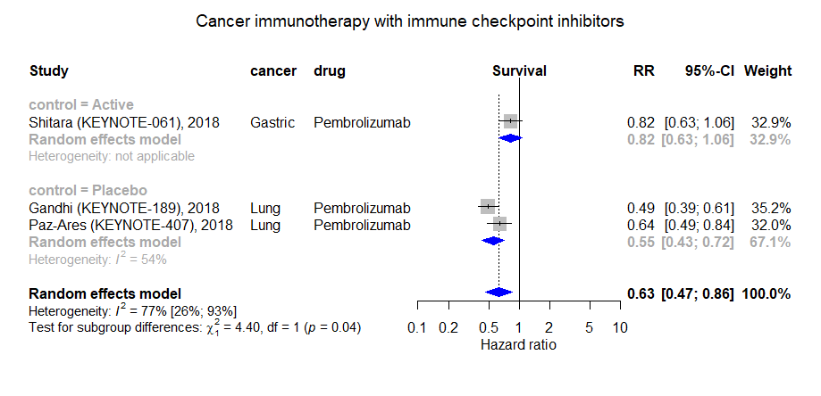

Cancer immunotherapy with immune checkpoint inhibitors
============================================
A living systematic review

Short url: http://openmetaanalysis.github.io/checkpoint-inhibitors

**Clinical summary:** This meta-analysis suggests that clinical intervention *is or is not* effective. Heterogeneity of results as measured by I2 was '[moderate](http://handbook-5-1.cochrane.org/chapter_9/9_5_2_identifying_and_measuring_heterogeneity.htm)' at XX%. This review updates the previously published meta-analysis.(1)

Meta-regression dooes not find modulators (year of publication, study size, event rate in the control groups) on the effect of the intervention.
* [Reconciliation of conclusions with prior meta-analyses](files/reconciliation-tables/Reconciliation%20of%20conclusions.pdf) (under construction)
* [Keep current with this topic](files/searching/Keep-up.md) (under construction)

Acknowledgement: we acknowledge the essential work by the authors of the prior systematic review(s) listed below.

**Methods overview:** This repository is an [openMetaAnalysis](https://openmetaanalysis.github.io/) that combines methods of scoping, rapid, and living systematic reviews.  This analysis updates one or more previously published review(s) below. A comparison of studies included in this review compared to prior reviews are in the table, [reconciliation of trials included with prior meta-analyses/](files/reconciliation-tables/Reconciliation%20of%20studies.pdf). Newer studies included are listed in the references below. Rationale for newer trials excluded may be listed at the end of the references. 
* [Methods](http://openmetaanalysis.github.io/methods.html) for openMetaAnalysis
* [Evidence search](files/searching/evidence-search.md) for this review (under construction)

**Results:** Details of the studies included are in the:
* [Reconciliation of trials included with prior meta-analyses/](files/reconciliation-tables/Reconciliation%20of%20studies.pdf) (under construction)
* [Description of studies (PICO table)](files/study-details/table-pico.pdf) (under construction)
* [Risk of bias assessment](files/study-details/table-bias.pdf) (under construction)
* [Forest plots](../master/files/forest-plots) ([source data](files/data))
* [Network plots](../master/files/network) (optional)
* [Reconciliation of conclusions with prior meta-analyses](files/reconciliation-tables/Reconciliation%20of%20conclusions.pdf)

The forest plot for the primary outcomes are below. Additional [forest plots](files/forest-plots) of secondary analyses may be available. 

<!--
The meta-regression for the primary outcomes are below. Additional [meta-regressions](files/metaregression) of secondary analyses may be available. 

-->

References:
----------------------------------

### Systematic review(s)
#### Most recent review at time of last revision of this repository
None

### Randomized controlled trials
#### New trial(s) *not* included in the most recent review above
1. Shitara K, Özgüroğlu M, Bang YJ, Di Bartolomeo M, Mandalà M, Ryu MH, Fornaro L, Olesiński T, Caglevic C, Chung HC, Muro K, Goekkurt E, Mansoor W, McDermott RS, Shacham-Shmueli E, Chen X, Mayo C, Kang SP, Ohtsu A, Fuchs CS; KEYNOTE-061 investigators. Pembrolizumab versus paclitaxel for previously treated, advanced gastric or gastro-oesophageal junction cancer (KEYNOTE-061): a randomised, open-label, controlled, phase 3 trial. Lancet. 2018 Jul 14;392(10142):123-133. doi: 10.1016/S0140-6736(18)31257-1. Epub 2018 Jun 4. PubMed PMID: [29880231](http://pubmed.gov/29880231).
2. Gandhi L, Rodríguez-Abreu D, Gadgeel S, Esteban E, Felip E, De Angelis F, Domine M, Clingan P, Hochmair MJ, Powell SF, Cheng SY, Bischoff HG, Peled N, Grossi F, Jennens RR, Reck M, Hui R, Garon EB, Boyer M, Rubio-Viqueira B, Novello S, Kurata T, Gray JE, Vida J, Wei Z, Yang J, Raftopoulos H, Pietanza MC, Garassino MC; KEYNOTE-189 Investigators. Pembrolizumab plus Chemotherapy in Metastatic Non-Small-Cell Lung Cancer. N Engl J Med. 2018 May 31;378(22):2078-2092. doi: 10.1056/NEJMoa1801005. Epub 2018 Apr 16. PubMed PMID: [29658856](http://pubmed.gov/29658856).

#### Trial(s) included in the review above
None

#### Trial(s) undergoing review
None

#### Trial(s) excluded - selected list of important trial(s)

#### Cited by
This repository is cited by:

1. WikiDoc contributors. Pending content page. WikiDoc. Nov 9, 2014. Available at: http://www.wikidoc.org/index.php/This_topic. Accessed November 9, 2014. 

-------------------------------
[Cite and use this content](https://github.com/openMetaAnalysis/openMetaAnalysis.github.io/blob/master/reusing.MD)  - [Edit this page](../../edit/master/README.md) - [License](files/LICENSE.md) - [History](../../commits/master/README.md)  - 
[Issues and comments](../../issues?q=is%3Aboth+is%3Aissue)

